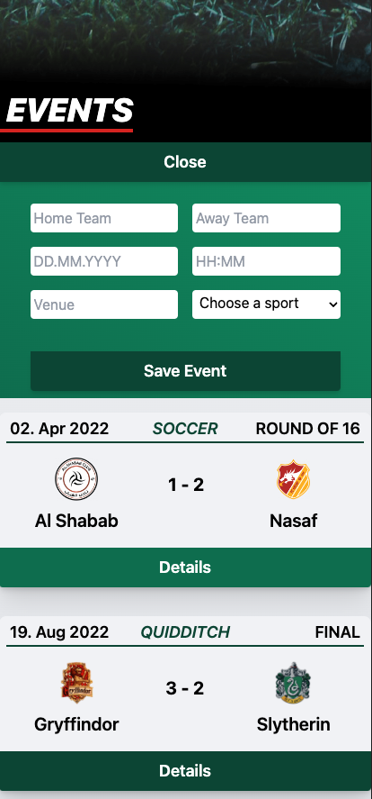
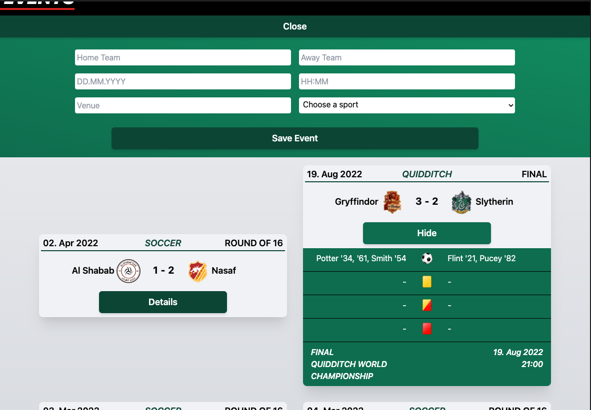
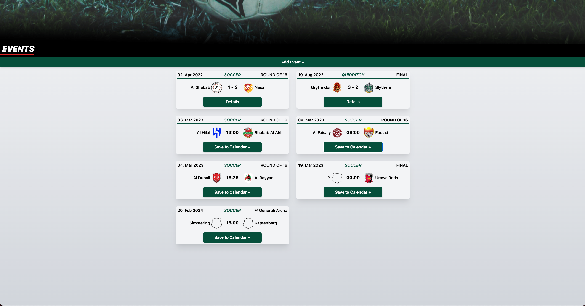

## Coding Challenge for the sportradar coding academy (front end)

# Stack: ReactJS + Tailwind CSS

Goals:
1. Coding Exercise
Goal is to implement a calendar for sport events. Events may be added to the calendar.
Examples:
- Sat., 18.07.2022, 18:30, Football, Salzburg – Sturm
- Sun., 23.10.2022, 09:45, Ice Hockey, KAC – Capitals
2. Detail Page, Overview
Take the data out of the JSON you got in the E-Mail and display it in an overview of all events.
Also provide an option to show the whole information of one event in a detail page.
3. Add Event
The possibility to add an event on runtime should be given. It is not needed to save the data
somewhere.
4. Responsiveness
The site should be fully responsive on mobile and tablet
5. Navigation
Create a rudimentary navigation to switch between overview and the add event page

Decided for a SPA, high contrast between navigation/header and content and reduced but comprehensive details view.

### Screenshots of final result

